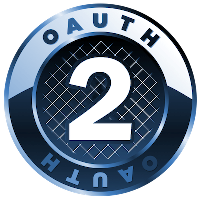
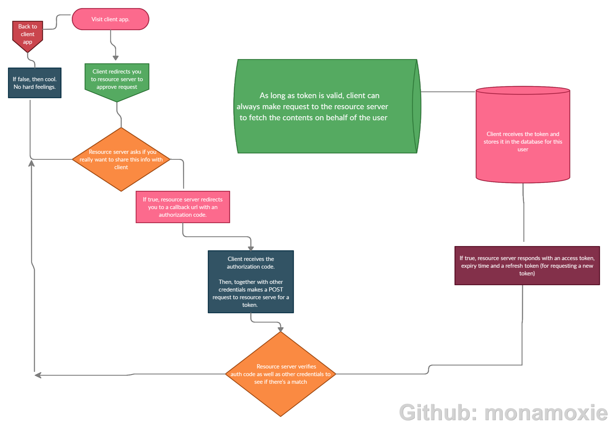

### OAuth 2.0 Framework - Authorization Code Grant (Standard Approach) 

### BRIEF OVERVIEW
Hey, this is me trying to briefly pan out a practical demo of the OAuth 2.0 framework as implemented by the League OAuth2 Server and built upon by Laravel Passport. 

OAuth is simply a token based authorization framework. The current standard being OAuth 2.0. 

Primarily, it permits a client to access protected resources with the help of tokens. How this token is gotten by a client and processed by the resource server may differ, depending on the use case. 

With the League OAuth2 Server, there are basically 5 ways a token can be issued.

1. Authorization code grant approach - further divided into
   - Standard Approach
   - PKCE Approach
2. Client credentials grant approach
3. Implicit grant approach
4. Resource owner password credentials grant approach
5. Refresh grant approach

For more on the terminologies and use case, you can check out it's documentation at https://oauth2.thephpleague.com/

For this demo, I will be using the  Authorization code grant (Standard Approach). 

### THE FLOW

### USAGE 
For Demo purposes only. Emphasis was not placed on security on my end.

### LICENSE
MIT License 
